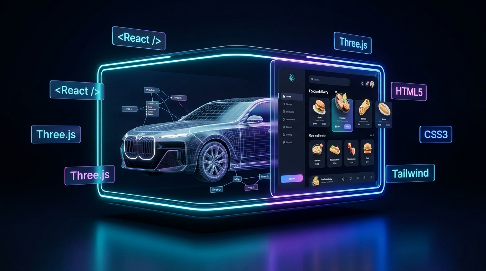

<p align="center">
  
</p>

<p align="center">
  
</p>


<p align="center">
  
</p>

<h1 align="center">🌐 WEB DEVELOPMENT PROJECTS : Curated Portfolio Showcase 🚀</h1>

<p align="center">
  <strong>Production-Grade Frontend Architecture • 3D WebGL Experiences • Modern Responsive UI/UX</strong><br/>
  <em>Engineered with React 18, Three.js, Tailwind CSS, Framer Motion, and Native Web Fundamentals!</em>
</p>

<!-- Global Tech Stack Badges -->
<p align="center">
  <a href="https://developer.mozilla.org/en-US/docs/Web/HTML"></a>
  <a href="https://developer.mozilla.org/en-US/docs/Web/CSS"></a>
  <a href="https://developer.mozilla.org/en-US/docs/Web/JavaScript"></a>
  <a href="https://react.dev/"></a>
  <a href="https://tailwindcss.com/"></a>
  <a href="https://threejs.org/"></a>
  <a href="https://www.framer.com/motion/"></a>
</p>

<!-- Developer Tools & AI Badges -->
<p align="center">
  
  
  
  
  <a href="#-license"></a>
</p>

<!-- Quick Jump Navigation -->
<p align="center">
  <a href="#-project-01-the-new-bmw-i7--7-series"><b>🚗 Explore BMW i7</b></a> •
  <a href="#-project-02-fooddrop--next-gen-food-delivery-ui"><b>🍔 Explore FoodDrop</b></a> •
  <a href="#-tech-stack-comparison-matrix"><b>⚡ Tech Matrix</b></a> •
  <a href="#-quick-start--how-to-run"><b>🛠️ How to Run</b></a> •
  <a href="#-about-the-author"><b>👨‍💻 Author</b></a>
</p>

---

<!-- ═══════════════ LEGAL & EDUCATIONAL DISCLAIMER ═══════════════ -->
<div align="center">
  <p style="color: #ff4d4d; font-weight: 700; font-size: 15px; border: 2px solid #ff4d4d; border-radius: 10px; padding: 16px 24px; background: rgba(255, 77, 77, 0.08); max-width: 880px; margin: 24px auto; line-height: 1.6;">
    🛑 <b>IMPORTANT NOTICE & EDUCATIONAL DISCLAIMER:</b><br/>
    THIS REPOSITORY IS CREATED STRICTLY FOR <b>EDUCATIONAL & PORTFOLIO SHOWCASE PURPOSES</b>.<br/>
    • All BMW trademarks, car designs, and logos belong exclusively to <b>Bayerische Motoren Werke AG (BMW)</b>.<br/>
    • FoodDrop is a personal concept UI and is not affiliated with any commercial food delivery platform.
  </p>
</div>

---

## 🧭 Featured Projects Hub

| Project | Focus & Experience | Primary Tech Stack | Status | Quick Access |
| :--- | :--- | :--- | :---: | :---: |
| 🏎️ **[BMW-Web](./BMW-Web/)** | Ultra-Luxury 3D Automotive Showcase, WebGL Anatomy, 4K Cinematics | `React 18` • `Three.js` • `Tailwind` • `Framer Motion` | `🔥 Production` | [**Launch BMW Experience ➔**](./BMW-Web/) |
| 🍔 **[Food.Drop-Web](./Food.Drop-Web/)** | High-Contrast Dark-Mode Food Storefront, Category Filters, Responsive Grid | `HTML5` • `CSS3` • `Vanilla JS (ES6+)` | `⚡ Live UI` | [**Launch FoodDrop ➔**](./Food.Drop-Web/) |

<details>
<summary><b>📂 Quick Jump Directory Index (Click to Expand)</b></summary>

<br />

| Folder | Direct Links | Core Purpose |
| :--- | :--- | :--- |
| **`BMW-Web/`** | [📁 Folder](./BMW-Web/) • [📄 index.html](./BMW-Web/index.html) • [📘 Documentation](./BMW-Web/README.md) | High-End 3D Luxury Automotive Portal |
| **`Food.Drop-Web/`** | [📁 Folder](./Food.Drop-Web/) • [📄 index.html](./Food.Drop-Web/index.html) • [📘 Documentation](./Food.Drop-Web/README.md) | Modern Appetite-Stimulating E-Commerce Storefront |

</details>

---

## 🏎️ Project 01: THE NEW BMW i7 & 7 SERIES

> **Location:** [`/BMW-Web`](./BMW-Web/)  
> **Type:** High-End 3D Automotive Experience  
> **Key Tech:** React 18, Three.js, Framer Motion, Tailwind CSS, Vite

<div align="center">
  
  <h3><i>"The Forwardism of Electrified Luxury"</i></h3>
</div>

### Key Architectural Highlights:
- 🌌 **Interactive 3D WebGL Anatomy**: Interactive 3D engine cutaways and 5th-Gen eDrive synchronous motor modules powered by Three.js.
- 🎬 **Official 4K Cinematics**: High-bitrate video backdrop featuring the BMW i7 xDrive60 in continuous motion.
- 💺 **Executive Sanctuary**: Virtual interactive tour of the 31.3" 8K BMW Theatre Screen & Sky Lounge Starlight panoramic roof.
- 🎨 **Real-Time Color Configurator**: Interactive selector for Carbon Black, Mineral White, and Oxide Grey with dynamic canvas updates.
- 🔇 **Pure Silent Luxury**: 100% sound-free design crafted for distraction-free executive viewing.
- ⚡ **Zero-Setup Live Server**: Runs directly from static files without requiring complex local build tools.

---

## 🍔 Project 02: FoodDrop - Next-Gen Food Delivery UI

> **Location:** [`/Food.Drop-Web`](./Food.Drop-Web/)  
> **Type:** Responsive On-Demand Food Storefront  
> **Key Tech:** Semantic HTML5, Modular CSS3, Vanilla JavaScript (ES6+)

<div align="center">
  
  <h3><i>"Next-Gen Appetite-Stimulating Experience"</i></h3>
</div>

### Key Architectural Highlights:
- 🍕 **High-Contrast Dark Canvas**: Deep-palette UI optimized for vivid food photography and nighttime browsing.
- 🔍 **Interactive Category Filtering**: Dynamic cuisine navigation with instant CSS hover transformations and smooth transitions.
- 📱 **Mobile-First Responsive Layout**: Engineered with modern CSS Grid and Flexbox for flawless viewing across phones, tablets, and 4K displays.
- ⚡ **Pure Vanilla Speed**: Zero external frameworks for instant browser execution and lightning-fast load times.
- 💡 **Clean Educational Separation**: Strict architectural boundaries between markup (`index.html`), styles (`style.css`), and logic (`script.js`).

---

## ⚡ Tech Stack Comparison Matrix

| Feature / Layer | 🏎️ BMW i7 Experience | 🍔 FoodDrop UI |
| :--- | :--- | :--- |
| **Primary Domain** | Luxury Automotive Showcase | On-Demand E-Commerce & Delivery |
| **Core Language** | JavaScript (ES6+ / React) | Vanilla JavaScript (ES6+) |
| **UI Architecture** | Component-Driven (React 18) | Semantic Native HTML5 DOM |
| **Styling Strategy** | Tailwind CSS (Utility-First) | Custom CSS3 (Flexbox, Grid & Keyframes) |
| **3D & Graphics** | WebGL / Three.js / Canvas | CSS Transforms & Visual Cards |
| **Motion Physics** | GPU-accelerated Framer Motion | Smooth CSS Transitions & Hover Effects |
| **AI Creative Role** | Google Gemini (Pic Generation) | Google Gemini (UI Design Logic) |
| **Execution** | VS Code Live Server / Static | VS Code Live Server / Browser Native |

---

## 🛠️ Quick Start & How to Run

Both projects are structured to run instantly using **VS Code Live Server** with zero dependency installation required:

### Option A: Launching BMW i7
1. Open this repository in **VS Code**:
   ```bash
   code "/Users/apple/Documents/WEB-PROJECTS"
   ```
2. Navigate to **`BMW-Web/index.html`**.
3. Right-click and choose **"Open with Live Server"**.
4. Experience the site live at `http://127.0.0.1:5500/BMW-Web/index.html`!

### Option B: Launching FoodDrop
1. In the VS Code file explorer, navigate to **`Food.Drop-Web/index.html`**.
2. Right-click and choose **"Open with Live Server"**.
3. Enjoy the storefront live at `http://127.0.0.1:5500/Food.Drop-Web/index.html`!

---

## 👨‍💻 About the Author

<div align="center">

  <h2>Tanmay (Adesh Srivastava)</h2>
  <p><strong>Agentic AI Developer • Systems & Software Engineer • Open-Source Creator</strong></p>

  <p>
    <a href="https://github.com/tanmay119-pera"></a>
    <a href="mailto:tanmay.w119@gmail.com"></a>
    <a href="https://github.com/tanmay119-pera/WEB-DEVELOPMENT-PROJECTS"></a>
  </p>

  <p>
    <b>"FOLLOW YOUR PASSION NOT THE RACE"</b>
  </p>

  <p>
    <em>"Crafted with precision to showcase modern frontend engineering, interactive 3D WebGL, and scalable web architectures."</em>
  </p>

  <p>
    ⭐ <strong>Found these web projects inspiring? Don't forget to star the repository!</strong> ⭐
  </p>

</div>

---

<div align="center">

### 📜 License
Distributed under the **MIT License**.

<br />

<p align="center">
  <sub>Crafted with ❤️ by <b>Tanmay (Adesh Srivastava)</b> • Happy Coding! 🚀</sub>
</p>

</div>